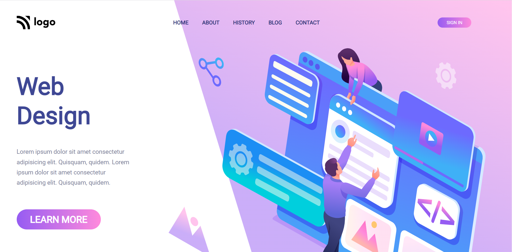
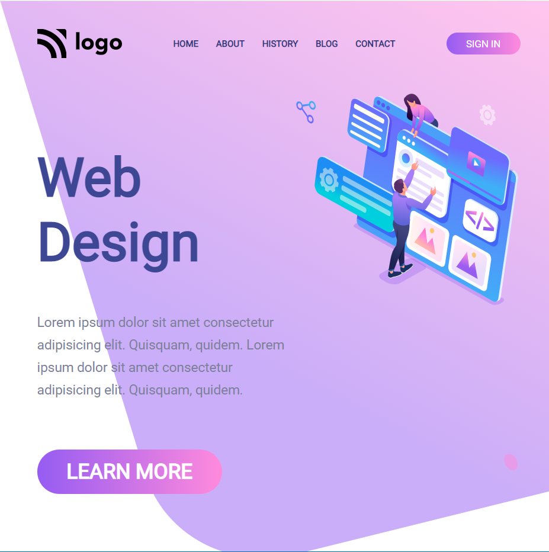
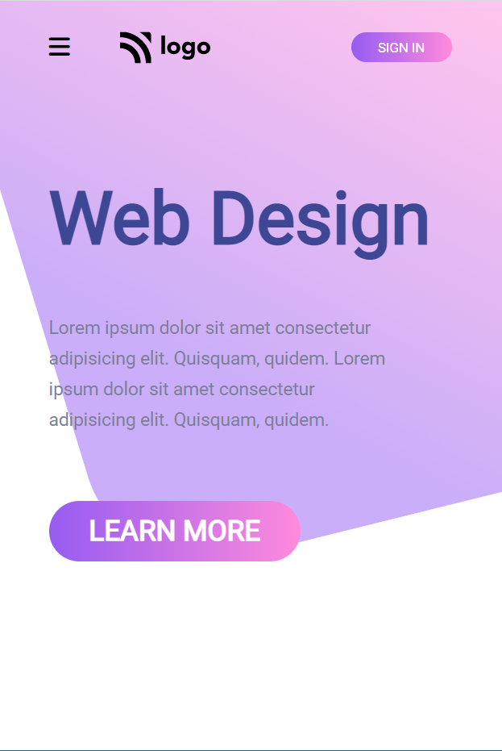

Author-Lalita Garg
# Product Homepage  

This Project is a Simple Static Responsive webpage created by using just HTML and  CSS.

## Key Learning 
***
- Media Queries 
- Flex and Flexbox
- Margin and Padding 
- Position 
- Navbar Designing 
- Responsive Design

## Preview | [Live Link](https://designlanding-page.netlify.app/)
***
  

## Technologies Used 
***

## Time Taken to complete this Project - 2hrs
